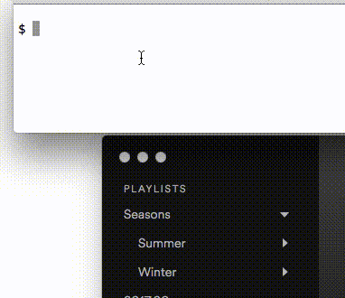

> [!WARNING]  
> **BREAKING CHANGE**. Spotify changed the cache storage tech as of 2023-11-30. The code was substantially rewritten. Please help test the new setup and report any issues in [this thread](https://github.com/mikez/spotify-folders/issues/10).

---

Get your Spotify folder hierarchy with playlists into a JSON file.

**Requirements**: Spotify for Mac, Linux, or Windows.

## Installation
```sh
curl -L https://git.io/folders > /usr/local/bin/spotifyfolders
chmod +x /usr/local/bin/spotifyfolders
```

If your folder hierarchy is stored in a compressed format, you may receive additional instructions on how to install the "snappy" decompression library. Also, you may want to close the Spotify app before running this to ensure data access and completeness.

## Get your entire folder hierarchy

Simply run

```sh
$ spotifyfolders
```

## Get a specific folder


## Example
```sh
$ spotifyfolders https://open.spotify.com/user/example/folder/f0dcb1c2b1a98521
```
```yaml
{
  "name": "Seasons",
  "type": "folder",
  "uri": "spotify:user:example:folder:f0dcb1c2b1a98521",
  "children": [{
    "name": "Summer",
    "type": "folder",
    "uri": "spotify:user:example:folder:8212237ac7347bfe",
    "children": [{
        "type": "playlist",
        "uri": "spotify:playlist:37i9dQZF1DXdCsscAsbRNz"
     }, {
        "type": "playlist",
        "uri": "spotify:playlist:37i9dQZF1DWZd79rJ6a7lp"
     }]
  }, {
    "name": "Winter",
    "type": "folder",
    "uri": "spotify:user:example:folder:4b254ce1b7f5e23d",
    "children": [{
      "type": "playlist",
      "uri": "spotify:playlist:37i9dQZF1DWSiZVO2J6WeI"
    }]
  }
}
```

## Learn about more options

```sh
$ spotifyfolders --help
```

## Background
The Spotify Web API does currently not support getting the folder hierarchy. However, one can (as of this writing) find it in the local Spotify cache. This script extracts the data from the cache and returns it in a JSON-formatted way.
